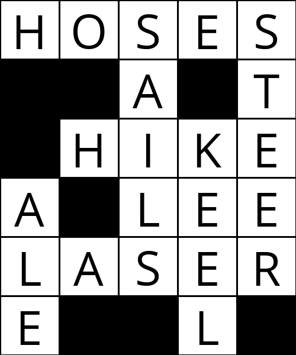
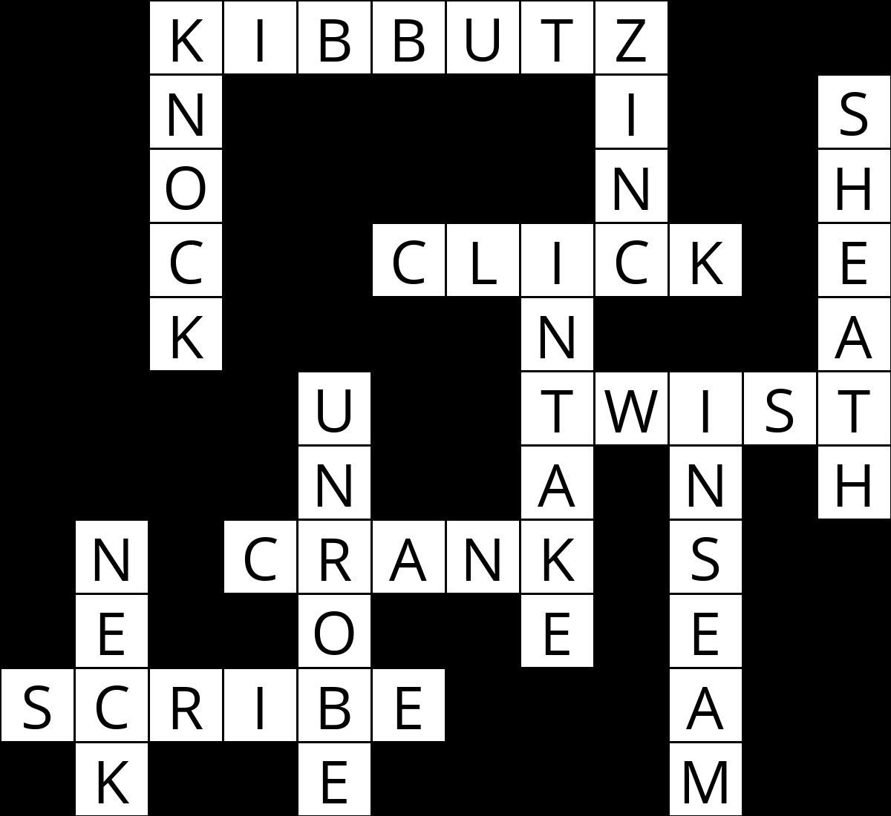

# Crossword AI
A crossword puzzle generator using the backtracking algorithm.

    Peter G. Mavronicolas
    Old Dominion University
    CS 580, Fall 2022
    Dr. Yaohang Li

## Code

### generate.py

```
import sys
from crossword import *
import numpy as np
import math
import os

class CrosswordCreator():
#initialize variables
    def __init__(self, crossword):
        """
        Create new CSP crossword generate.
        """
        self.crossword = crossword
        self.domains = {
            var: self.crossword.words.copy()
            for var in self.crossword.variables
        }
#creates grid based on structure.txt file
    def letter_grid(self, assignment):
        """
        Return 2D array representing a given assignment.
        """
        letters = [
            [None for _ in range(self.crossword.width)]
            for _ in range(self.crossword.height)
        ]
        #for loop to determine if word is horizontal or vertical
        for variable, word in assignment.items():
            direction = variable.direction
            for k in range(len(word)):
                i = variable.i + (k if direction == Variable.DOWN else 0)
                j = variable.j + (k if direction == Variable.ACROSS else 0)
                letters[i][j] = word[k]

        return letters
#outputs the crossword in the terminal window
    def print(self, assignment):
        """
        Print crossword assignment to the terminal.
        """
        #nested for loop iterating through the 2D array
        letters = self.letter_grid(assignment)
        for i in range(self.crossword.height):
            for j in range(self.crossword.width):
                if self.crossword.structure[i][j]:
                    print(letters[i][j] or " ", end="")
                else:
                    print("█", end="")
            print()
#outputs a file whose name is determined in terminal. PIL replaced by Pillow
    def save(self, assignment, filename):
        """
        Save crossword assignment to an image file.
        """
        from PIL import Image, ImageDraw, ImageFont
        cell_size = 100
        cell_border = 2
        interior_size = cell_size - 2 * cell_border
        letters = self.letter_grid(assignment)

        # Create a blank canvas
        img = Image.new(
            "RGBA",
            (self.crossword.width * cell_size,
             self.crossword.height * cell_size),
            "black"
        )
        font = ImageFont.truetype("assets/fonts/OpenSans-Regular.ttf", 80)
        draw = ImageDraw.Draw(img)

        for i in range(self.crossword.height):
            for j in range(self.crossword.width):

                rect = [
                    (j * cell_size + cell_border,
                     i * cell_size + cell_border),
                    ((j + 1) * cell_size - cell_border,
                     (i + 1) * cell_size - cell_border)
                ]
                if self.crossword.structure[i][j]:
                    draw.rectangle(rect, fill="white")
                    if letters[i][j]:
                        w, h = draw.textsize(letters[i][j], font=font)
                        draw.text(
                            (rect[0][0] + ((interior_size - w) / 2),
                             rect[0][1] + ((interior_size - h) / 2) - 10),
                            letters[i][j], fill="black", font=font
                        )

        img.save(filename)
#calls the backtrack function
    def solve(self):
        """
        Enforce node and arc consistency, and then solve the CSP.
        """
        self.enforce_node_consistency()
        self.ac3()
        return self.backtrack(dict())

    def enforce_node_consistency(self):
        """
        Update `self.domains` such that each variable is node-consistent.
        (Remove any values that are inconsistent with a variable's unary
         constraints; in this case, the length of the word.)
        """
        for var in self.domains:
            for word in set(self.domains[var]):
                if len(word) != var.length:
                    self.domains[var].remove(word)
#replace words if necessary
    def revise(self, x, y):
        """
        Make variable `x` arc consistent with variable `y`.
        To do so, remove values from `self.domains[x]` for which there is no
        possible corresponding value for `y` in `self.domains[y]`.

        Return True if a revision was made to the domain of `x`; return
        False if no revision was made.
        """
        revised = False
        i, j = self.crossword.overlaps[x, y]

        for x_word in set(self.domains[x]):
            remove = True

            for y_word in self.domains[y]:
                if x_word[i] == y_word[j]:
                    remove = False

            if remove:
                self.domains[x].remove(x_word)
                revised = True

        return revised
#function applying arc3 algorithm
    def ac3(self, arcs=None):
        """
        Update `self.domains` such that each variable is arc consistent.
        If `arcs` is None, begin with initial list of all arcs in the problem.
        Otherwise, use `arcs` as the initial list of arcs to make consistent.

        Return True if arc consistency is enforced and no domains are empty;
        return False if one or more domains end up empty.
        """
        if arcs is None:
            arcs = list()
            for x in self.domains:
                for y in self.crossword.neighbors(x):
                    arcs.append((x, y))
#while loop with conditional statements to revise words
        while arcs:
            x, y = arcs.pop()

            if self.revise(x, y):
                if not self.domains[x]:
                    return False
                for z in self.crossword.neighbors(x) - self.domains[y]:
                    arcs.append((z, x))

        return True

    def assignment_complete(self, assignment):
        """
        Return True if `assignment` is complete (i.e., assigns a value to each
        crossword variable); return False otherwise.
        """
        return not bool(self.crossword.variables - set(assignment))

    def consistent(self, assignment):
        """
        Return True if `assignment` is consistent (i.e., words fit in crossword
        puzzle without conflicting characters); return False otherwise.
        """
        used_words = set()

        for var in assignment:

            # Distinct values
            if assignment[var] not in used_words:
                used_words.add(assignment[var])
            else:
                return False

            # Checking correct length
            if len(assignment[var]) != var.length:
                return False

            # No conflicts between neighbors
            for neighbor in self.crossword.neighbors(var):
                if neighbor in assignment:
                    i, j = self.crossword.overlaps[var, neighbor]
                    if assignment[var][i] != assignment[neighbor][j]:
                        return False

        return True
#sorts the list of words
    def order_domain_values(self, var, assignment):
        """
        Return a list of values in the domain of `var`, in order by
        the number of values they rule out for neighboring variables.
        The first value in the list, for example, should be the one
        that rules out the fewest values among the neighbors of `var`.
        """
        n = dict()

        for value in self.domains[var]:
            n[value] = 0
            for neighbor in self.crossword.neighbors(var) - assignment:
                if value in self.domains[neighbor]:
                    n[value] += 1

        return sorted(n, key=n.get)
#function to return unassigned variable and determine yie breaker
    def select_unassigned_variable(self, assignment):
        """
        Return an unassigned variable not already part of `assignment`.
        Choose the variable with the minimum number of remaining values
        in its domain. If there is a tie, choose the variable with the highest
        degree. If there is a tie, any of the tied variables are acceptable
        return values.
        """
        best = None

        for var in self.crossword.variables - set(assignment):
            if (
                best is None or
                len(self.domains[var]) < len(self.domains[best]) or
                len(self.crossword.neighbors(var)) > len(self.crossword.neighbors(best))
            ):
                best = var

        return best

    def backtrack(self, assignment):
        """
        Using Backtracking Search, take as input a partial assignment for the
        crossword and return a complete assignment if possible to do so.

        `assignment` is a mapping from variables (keys) to words (values).

        If no assignment is possible, return None.
        """
        if self.assignment_complete(assignment):
            return assignment

        var = self.select_unassigned_variable(assignment)

        for value in self.domains[var]:
            assignment[var] = value

            if self.consistent(assignment):
                result = self.backtrack(assignment)
                if result is not None:
                    return result

            assignment.pop(var)

        return None

# included anytime gbfs function from sokoban assignment
def anytime_gbfs(initial_state, heur_fn, timebound=10):
    # declarations
    '''Provides an implementation of anytime greedy best-first search, as described in the HW1 handout'''
    '''INPUT: a sokoban state that represents the start state and a timebound (number of seconds)'''
    '''OUTPUT: A goal state (if a goal is found), else False'''
    best_path_cost = float("inf")
    time_remain = 8
    iter = 0

    se = SearchEngine('best_first', 'full')
    se.init_search(initial_state, goal_fn=sokoban_goal_state, heur_fn=heur_fn)
    # while loop with time after start and excluding search engine.open.empty
    while (time_remain > 0) and not se.open.empty():
        iter += 1
        t_start = os.times()[0]
        print(t_start)
        # conditional statement of first iteration
        if iter == 1:
            final = se.search(timebound)

            try:
                goalval = final.gval
                time_remain = 8 - t_start
                if goalval < best_path_cost:
                    best_path_cost = goalval
                    optimal_final = final

            except:  # when final = False
                time_remain = 8 - t_start

        else:
            costbound = (best_path_cost, float('inf'), float('inf'))
            final = se.search(timebound, costbound)

            try:
                goalval = final.gval
                time_remain = 8 - t_start
                if goalval < best_path_cost:
                    best_path_cost = goalval
                    optimal_final = final

            except:  # when final = False
                time_remain = 8 - t_start

    try:
        return optimal_final
    except:
        return final
#main to call functions
def main():

    # Check usage
    if len(sys.argv) not in [3, 4]:
        sys.exit("Usage: python generate.py structure words [output]")

    # Parse command-line arguments
    structure = sys.argv[1]
    words = sys.argv[2]
    output = sys.argv[3] if len(sys.argv) == 4 else None

    # Generate crossword
    crossword = Crossword(structure, words)
    creator = CrosswordCreator(crossword)
    assignment = creator.solve()

    # Print result
    if assignment is None:
        print("No solution.")
    else:
        creator.print(assignment)
        if output:
            creator.save(assignment, output)


if __name__ == "__main__":
    main()
```


### crossword.py
```commandline
class Variable():
# declare variables
    ACROSS = "across"
    DOWN = "down"
# initialize i and j, directions and length parameters
    def __init__(self, i, j, direction, length):
        """Create a new variable with starting point, direction, and length."""
        self.i = i
        self.j = j
        self.direction = direction
        self.length = length
        self.cells = []
        for k in range(self.length):
            self.cells.append(
                (self.i + (k if self.direction == Variable.DOWN else 0),
                 self.j + (k if self.direction == Variable.ACROSS else 0))
            )
# built in function to return the hash value if one exists
    def __hash__(self):
        return hash((self.i, self.j, self.direction, self.length))
# only returns if the variables are equal
    def __eq__(self, other):
        return (
            (self.i == other.i) and
            (self.j == other.j) and
            (self.direction == other.direction) and
            (self.length == other.length)
        )
# returns the string values
    def __str__(self):
        return f"({self.i}, {self.j}) {self.direction} : {self.length}"
# function to return a printable representation
    def __repr__(self):
        direction = repr(self.direction)
        return f"Variable({self.i}, {self.j}, {direction}, {self.length})"


class Crossword():
# initialize data files
    def __init__(self, structure_file, words_file):
#access structure file
        # Determine structure of crossword
        with open(structure_file) as f:
            contents = f.read().splitlines()
            self.height = len(contents)
            self.width = max(len(line) for line in contents)
#initialize crossword structure and for nested loop to iterate through file
            self.structure = []
            for i in range(self.height):
                row = []
                for j in range(self.width):
                    if j >= len(contents[i]):
                        row.append(False)
                    elif contents[i][j] == "_":
                        row.append(True)
                    else:
                        row.append(False)
                self.structure.append(row)

# Save vocabulary list
        with open(words_file) as f:
            self.words = set(f.read().upper().splitlines())

        # Determine variable set
        self.variables = set()
        for i in range(self.height):
            for j in range(self.width):

                # Vertical words
                starts_word = (
                    self.structure[i][j]
                    #structure2[10][5] = 'N'
                    #structure2[10][6] = 'T'
                    #structure2[10][7] = 'H'
                    and (i == 0 or not self.structure[i - 1][j])
                )
                if starts_word:
                    length = 1
                    for k in range(i + 1, self.height):
                        if self.structure[k][j]:
                            length += 1
                        else:
                            break
                    if length > 1:
                        self.variables.add(Variable(
                            i=i, j=j,
                            direction=Variable.DOWN,
                            length=length
                        ))

                # Horizontal words
                starts_word = (
                    self.structure[i][j]
                    and (j == 0 or not self.structure[i][j - 1])
                )
                if starts_word:
                    length = 1
                    for k in range(j + 1, self.width):
                        if self.structure[i][k]:
                            length += 1
                        else:
                            break
                    if length > 1:
                        self.variables.add(Variable(
                            i=i, j=j,
                            direction=Variable.ACROSS,
                            length=length
                        ))
#checks for overlap of letters and continues if equal
        # Compute overlaps for each word
        # For any pair of variables v1, v2, their overlap is either:
        #    None, if the two variables do not overlap; or
        #    (i, j), where v1's ith character overlaps v2's jth character
        self.overlaps = dict()
        for v1 in self.variables:
            for v2 in self.variables:
                if v1 == v2:
                    continue
                cells1 = v1.cells
                cells2 = v2.cells
                intersection = set(cells1).intersection(cells2)
                if not intersection:
                    self.overlaps[v1, v2] = None
                else:
                    intersection = intersection.pop()
                    self.overlaps[v1, v2] = (
                        cells1.index(intersection),
                        cells2.index(intersection)
                    )
#function to return set of overlapping variables
    def neighbors(self, var):
        """Given a variable, return set of overlapping variables."""
        return set(
            v for v in self.variables
            if v != var and self.overlaps[v, var]
        )
```

## Analysis
The first crossword (structure0.txt) was generated within a second which was expected since the dataset of words and the number of words in the crossword were small amounts. 



The second  crossword (structure1.txt) had a longer execution time due to the increases number of words available in words1.txt and the increased number of words in the puzzle.



The third crossword (structure2.txt) was the most difficult to attempt. The strategy is to begin solving the puzzle with the longest words first and then insert the next longest word. Also, words with more vowels are highly desirable as they offer more combinations than consonants.
After several attempts to modify the crossword.py file to decrement from an 11 letter word, I was unfortunately unable to complete the puzzle.
If time allows, I wish to return to the third puzzle and make extra attempts to solve it before the conclusion of the semester.

# Works Cited
* Strahl, R. (2018, July 13). Getting images into markdown documents and weblog posts with Markdown Monster. Medium. Retrieved October 18, 2022, from https://medium.com/markdown-monster-blog/getting-images-into-markdown-documents-and-weblog-posts-with-markdown-monster-9ec6f353d8ec 
* Yu, B., &amp; Malan, D. J. (n.d.). Crossword - CS50's introduction to artificial intelligence with python. Crossword - CS50's Introduction to Artificial Intelligence with Python. Retrieved October 18, 2022, from https://cs50.harvard.edu/ai/2020/projects/3/crossword/
* Citation machine® - write smarter. Citation Machine, a Chegg service. (n.d.). Retrieved October 18, 2022, from https://www.citationmachine.net/ 
* Tim. (n.d.). How to display code in a markdown file – what is Mark Down. Retrieved November 5, 2022, from https://whatismarkdown.com/how-to-display-code-in-a-markdown-file-2/ 
* John. (2021, July 31). An artificial intelligence based crossword puzzle solver. Python Awesome. Retrieved November 4, 2022, from https://pythonawesome.com/an-artificial-intelligence-based-crossword-puzzle-solver/ 
* Vaibhaw, K. E. (n.d.). Krvaibhaw/Wordplay: Wordplay, an artificial intelligence based crossword puzzle solver. GitHub. Retrieved November 4, 2022, from https://github.com/krvaibhaw/wordplay 
* CSCI E-80. Crossword. (n.d.). Retrieved November 4, 2022, from https://cs50.harvard.edu/extension/ai/2022/fall/projects/3/crossword/ 